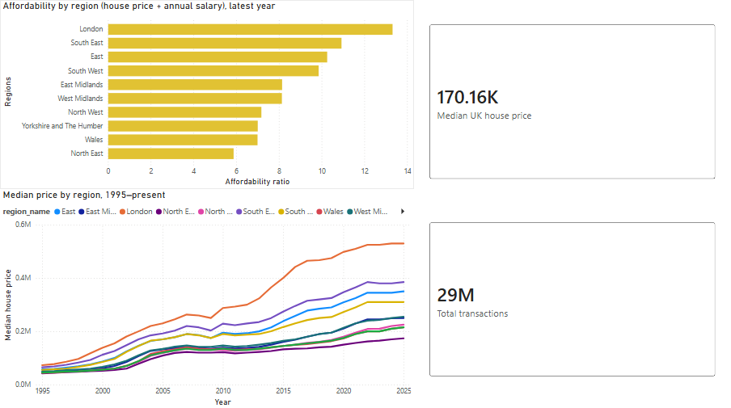
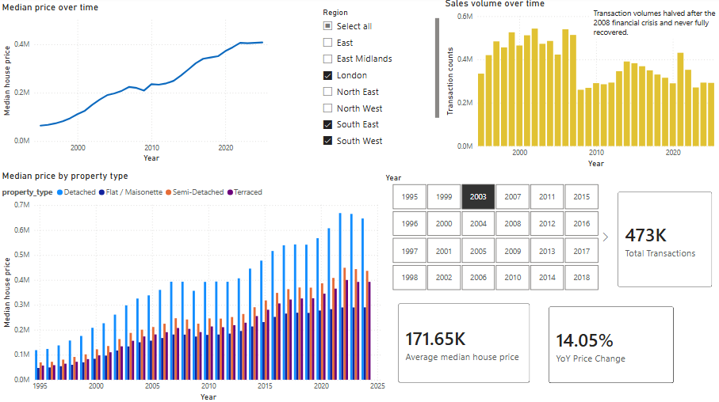
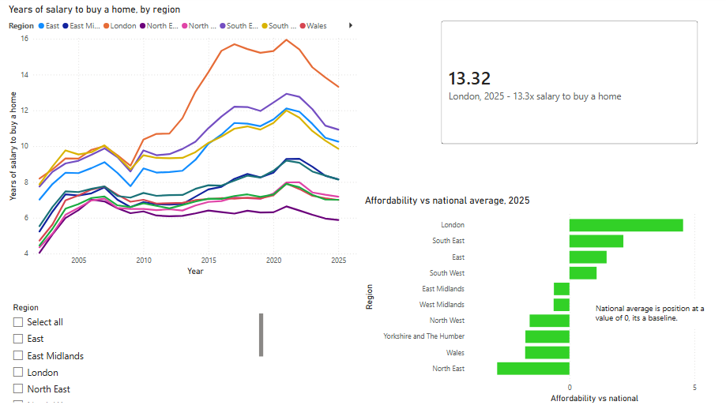
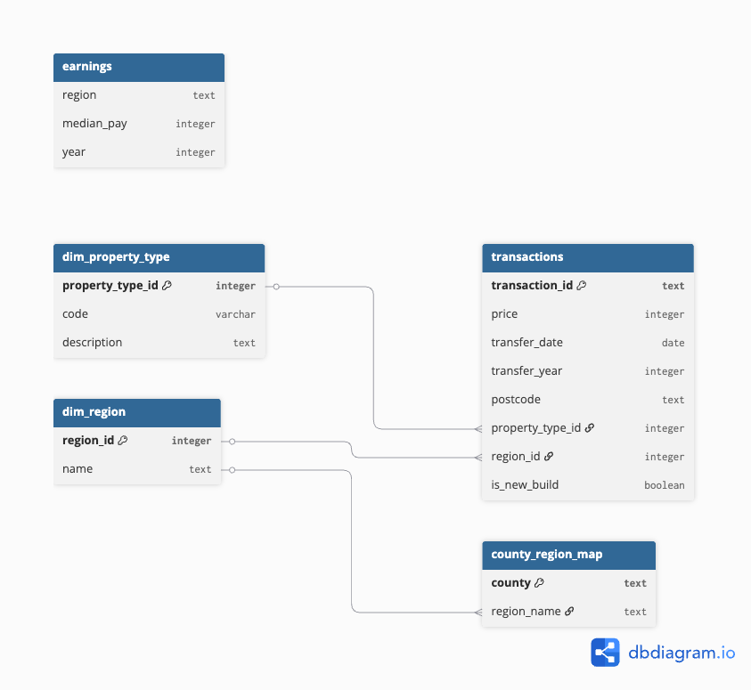

# UK Housing Analytics

Analytics pipeline over 31M+ UK property transactions: a PostgreSQL schema, analytical SQL, and a Power BI dashboard on regional prices and affordability.

## Overview

This project combines two open UK datasets to answer a question that neither can answer alone: not just how house prices have moved since 1995, but how they have moved relative to what people in each region actually earn.

Prices come from HM Land Registry; earnings from the ONS. The ratio between them, median house price divided by median gross annual pay, is the affordability measure this project is built around.

## Dashboard

The Power BI report reads from four aggregate SQL views (`v_median_price`, `v_affordability`, `v_volume`, and `v_price_by_type`) rather than the 29.5M-row fact table, so every interaction stays fast. Slicers cross-filter all visuals, and three DAX measures — total transactions, year-on-year price change, and each region's affordability against the national average — drive the headline figures.

### National Overview

Regions ranked by affordability, alongside median-price trends by region since 1995.

### Regional Deep-Dive

One region at a time: its price trend, sales volume, and how detached, semi-detached, terraced, and flat prices diverge over time.

### Affordability

Years of salary per home by region, and each region measured against the national average.

## Data sources

### HM Land Registry - Price Paid Data

Every residential property sale registered in England and Wales since January 1995. Downloaded as the single complete file (`pp-complete.csv`, ~5.1 GiB).

- Source: [Price Paid Data downloads](https://www.gov.uk/government/statistical-data-sets/price-paid-data-downloads)
- Direct file: [pp-complete.csv](https://price-paid-data.publicdata.landregistry.gov.uk/pp-complete.csv)
- Column definitions: [About the Price Paid Data](https://www.gov.uk/guidance/about-the-price-paid-data)

31,346,259 rows, one per transaction. 16 columns, no header row; the layout is documented separately by HM Land Registry. Key fields are price paid, date of transfer, postcode, property type (D/S/T/F/O), old-or-new build, and address components down to county level. There is no region column, so region is derived from county during schema design.

The file is too large to load comfortably into pandas, which is the point: it forces the analysis into SQL, where it belongs.

### ONS - Annual Survey of Hours and Earnings (ASHE), Table 8

Median gross annual pay by region, from a 1% sample of PAYE employee records, surveyed each April.

- Source: [ASHE Table 8, place of residence by local authority](https://www.ons.gov.uk/employmentandlabourmarket/peopleinwork/earningsandworkinghours/datasets/placeofresidencebylocalauthorityashetable8)
- Survey background: [Annual Survey of Hours and Earnings](https://www.ons.gov.uk/ashe)
- Latest bulletin: [Employee earnings in the UK](https://www.ons.gov.uk/employmentandlabourmarket/peopleinwork/earningsandworkinghours/bulletins/annualsurveyofhoursandearnings/latest)

Table 8 gives the place-of-residence breakdown, by home-based region down to local authority level. Within each annual release, Table 8.7a holds gross annual pay. 24 annual releases were downloaded, covering 2002-2025.

Place-of-residence is used rather than place-of-work because the comparison of interest is what people living in a region earn against what homes in that region cost.

## Repository structure

    ingest/      Python: download and bulk-load into PostgreSQL
    sql/         Schema build scripts and, under analysis/, the analytical queries
    notebooks/   Exploratory work
    dashboard/   Power BI report (.pbix) and page screenshots
    docs/        Schema diagram
    data/        Raw data (gitignored - too large for GitHub)

## Approach

1. Ingest. Price Paid is bulk-loaded via PostgreSQL's `COPY` into a wide staging table where every column is `TEXT` - loading untyped avoids a single malformed value aborting a 31M-row load (which completed in ~95 seconds). The 24 ASHE spreadsheets, one per year in inconsistent formats, are parsed and combined with pandas.
2. Schema. A star schema: a typed `transactions` fact table (29.5M standard transactions) linked to `dim_region` and `dim_property_type`, plus an `earnings` table. Region is derived from Land Registry county values via a 132-row `county_region_map`. Indexed on year and on (region, year); the index cut a regional aggregation from ~2.2s to ~0.19s.
3. Analysis. 13 saved, commented queries in `sql/analysis/`, using CTEs, window functions (`LAG`, `RANK`, `FIRST_VALUE`/`LAST_VALUE`, framed rolling averages), conditional aggregation, and cross-source joins. They build from median price by region and year up to the affordability ratio and the London-North divergence.
4. Dashboard. Power BI connected to PostgreSQL, reading from aggregate SQL views rather than the raw fact table. Three pages — a national overview, a regional deep-dive with a property-type price breakdown, and an affordability view — with slicers, cross-filtering, and three DAX measures.

## Schema

The `transactions` fact table holds one row per property sale (29.5M standard price-paid transactions), linked by integer keys to `dim_region` and `dim_property_type`. Region is derived from Land Registry county values through `county_region_map`, which maps 132 historic and current counties onto the 12 ONS regions. The `earnings` table joins to transactions on region and year at query time rather than through an enforced key, since it comes from a separate source.

Prices and dates are cast to proper types during the load; `transfer_year` is precomputed for grouping. Two indexes support the analytical queries: one on year, and a composite on (region, year).

## Findings

All figures come from the queries in `sql/analysis/`. Affordability is median house price divided by median gross annual pay - the number of years' salary a typical home costs.

**Affordability roughly doubled across every region.** In the East, a typical home cost 7.0 years' salary in 2002 and 12.1 at the 2021 peak, easing to 10.3 by 2025. The recent easing is wage-driven, not price-driven: prices flattened while pay finally rose.

**London is in a different league.** In 2025 a London home cost 13.3 years' salary, against 5.9 in the North East - more than double the multiple. The gap between regions is driven by house prices, not earnings: median pay varies about 34% across regions, but median prices vary over 200%.

**The London-North gap widened in a specific window, then eased.** It narrowed to 2009, then widened sharply from 2010 to 2017 - London's affordability ratio rose from 10 to nearly 16 while the three northern regions held near 7 - before easing back as London's ratio fell after 2017. It was not a steady, permanent divergence but a post-crisis London boom that later partly reversed.

**Price growth follows a clean south-to-north gradient.** Median prices grew between 312% (North East) and 626% (London) from 1995 to 2025. The wealthier southern regions appreciated fastest, so the fastest-growing regions were also the already-expensive ones - divergence reinforced on both price and affordability.

**New-build premiums are far higher in cheaper regions.** New-builds command 40-80% more than existing homes in the North and Wales, but under 10% - and occasionally a discount - in London and the South East, where the existing housing stock holds its value.

## Limitations

- Coverage differs between sources. Price Paid runs from 1995; ASHE Table 8 from 2002. Price trends therefore span 30 years, but affordability analysis is scoped to the 2002-2025 overlap.
- The latest year is a partial year of registrations and is excluded from price-trend queries, so trends are not distorted by an incomplete final point.
- 2025 ASHE figures are provisional. ONS publishes provisional figures each October and revises them the following year. All years to 2024 use the revised edition; 2025 uses provisional, and is subject to change.
- Edition notes. ONS published two editions of 2006 under different methodologies; this project uses the one consistent with 2007 onward. The 2011 release used here is the revised edition based on SOC 2010.
- ASHE is a sample survey, not a census, so regional medians carry sampling error. ONS publishes coefficients of variation alongside each table (the `8.7b` files), which are not used here.
- Price Paid excludes some transaction types, including transfers not at full market value and most commercial property.

## Reproducing this

### 1. Set up

Install PostgreSQL and create the database:

    createdb housing

Clone this repo, then create and activate a virtual environment:

    python3 -m venv .venv
    source .venv/bin/activate
    pip install -r requirements.txt

Copy `.env.example` to `.env` and fill in your database credentials.

### 2. Get the data

Both datasets are gitignored (too large for GitHub), so download them into `data/` yourself.

Price Paid (a single ~5 GB file):

    curl -o data/pp-complete.csv "https://price-paid-data.publicdata.landregistry.gov.uk/pp-complete.csv"

ASHE earnings: download the annual zips for 2002-2025 from the [ASHE Table 8 page](https://www.ons.gov.uk/employmentandlabourmarket/peopleinwork/earningsandworkinghours/datasets/placeofresidencebylocalauthorityashetable8). Take the revised edition for each year where available, and provisional for the latest year. Unzip each into `data/ashe/ashe_YYYY/`. Only the `Table 8.7a - Annual pay - Gross` file from each release is used. The ONS site rate-limits scripted downloads, so a browser is more reliable than curl for these.

### 3. Load the data

    ./ingest/load_raw.sh
    python ingest/load_ashe.py

The first script creates the staging table, bulk-loads Price Paid via `COPY`, builds the star schema, and reports the row count. The second parses the 24 ASHE spreadsheets into a combined `earnings` table of median pay across 2002 to 2025 for the 12 UK regions.

### 4. Build the views

    psql -d housing -f sql/analysis/views.sql

Creates the four aggregate views the Power BI report reads from. The report in `dashboard/` connects to PostgreSQL and can then be refreshed against them.

## Licence and attribution

Contains HM Land Registry data © Crown copyright and database right 2026, licensed under the [Open Government Licence v3.0](http://www.nationalarchives.gov.uk/doc/open-government-licence/version/3/).

Contains ONS data © Crown copyright, licensed under the [Open Government Licence v3.0](http://www.nationalarchives.gov.uk/doc/open-government-licence/version/3/).
